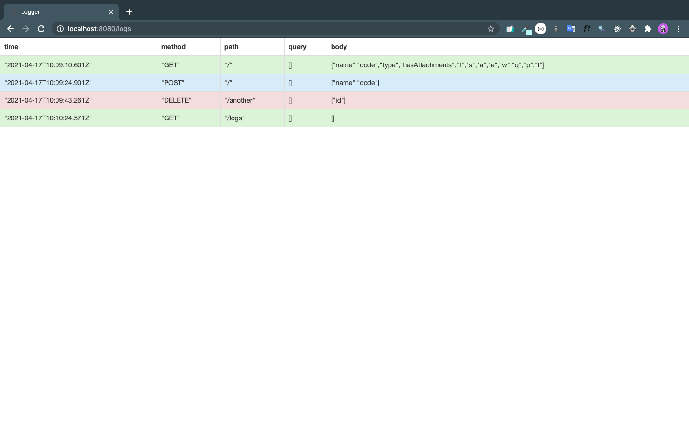
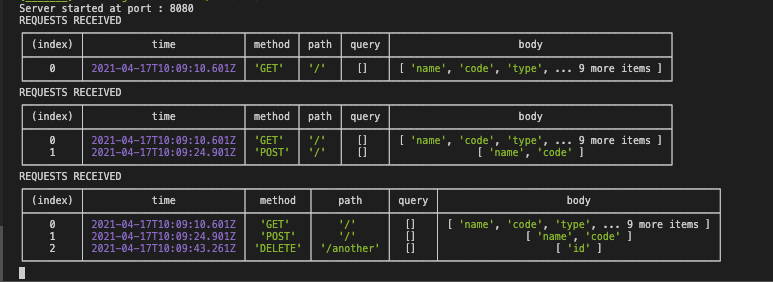

# *REQLOGS*
  A library to log the HTTP requests coming to the server for debugging, testing and monitoring purposes.
<hr>
It acts as a middleware and logs the request data in form of table in console and render it in form of bootstrap tables, everytime a request comes.
This solves the problem of debugging by console logging request data manually everytime a route doesn't work.

### Installation
This is mostly useful for debugging purposes, so to install it as a dev-dependency you can simply install the npm package with dev flag.
```sh
  npm install --save-dev reqlogs
```

### How to use and configure
```
  const express = require('express')
  const app = express()
  const PORT = process.env.PORT || 8081
  
  // import the library
  const {RequestLogger} = require('reqlogs')
  
  // select the parameters you want to log from the HTTP request.
  const parameters = {
    time: true,
    method: true,
    path : true,
    query : true,
    body : true 
  }
  // an array of paths you want the logger to ignore
  const ignore_urls = ['/a', '/b']  
  
  // a boolean (optional) , for ordering of the data in table logs
  const showLatestFirst = true
  
  // create an object and pass the parameters
  const RL = new RequestLogger({ignore_urls, parameters, showLatestFirst})
  
  // essential middleware...
  app.use(express.json())
  app.use(express.urlencoded({extended:true}))
  .
  .
  .
  
  
  // put RL middlewares at the bottom just above the routes/api
  app.use(RL.Console())
  // specify the url for the webview
  const url = '/logs'
  app.use(RL.Webpage({url}))


 app.use(API)

  app.listen(PORT, () => {
      console.log(`Server started at port : ${PORT}`)
  })

```
> Tip : This will work only if your server already has the required middlewares setup before the reqlogs middleware like cookies-parser for cookies and express.json() for body etc.

### Working
This will log your request data in form of tables in console and will render a webview as well.

Webview for an example server

Console for an example server



[NPM](https://www.npmjs.com/package/reqlogs)
